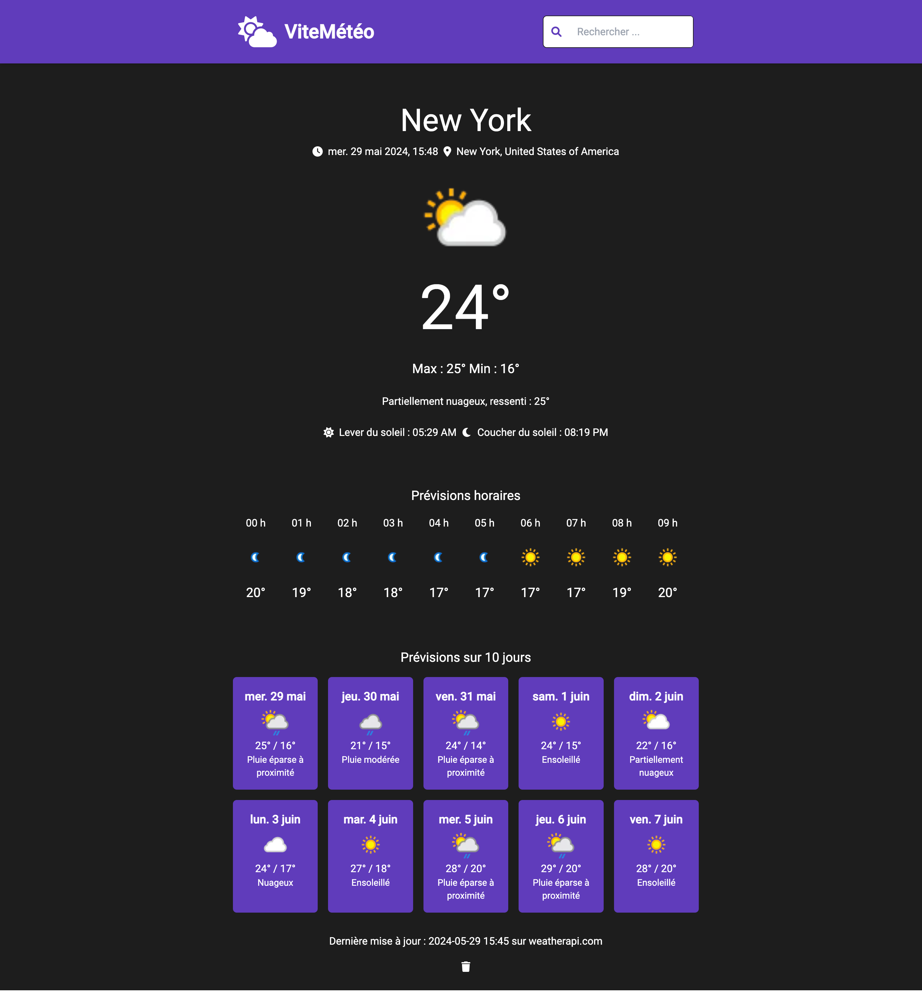

# 🛰️ ViteMétéo – Weather Forecast App (Vue 3 + Vite)

ViteMétéo is a lightweight weather forecast app built with **Vue 3**, **Vite**, and the [WeatherAPI.com](https://www.weatherapi.com) API. It allows users to search cities and view:

- 🏙️ Location info
- 🌡️ Current temperature & condition
- ☀️ Sunrise & 🌙 Sunset times
- 🕐 Hourly forecast (scrollable)
- 📅 3-day forecast (grid layout)

## ✨ Features

- 🔍 City search with auto-complete
- 📡 Real-time weather data (in French)
- 🧩 Modular component structure (after full `WeatherInfo.vue` refactor)
- 🧼 Clean UI powered by Tailwind CSS
- 📱 Fully responsive layout

## 🛠 Recommended IDE Setup

- [VS Code](https://code.visualstudio.com/)
- Extension: [Vue - Official](https://marketplace.visualstudio.com/items?itemName=Vue.volar)
- Disable: Vetur (if installed)

## 🖼️ UI Preview



## 🚀 Project Setup

Install dependencies:

```bash
npm install
```

Run development server:

```bash
npm run dev
```

Build for production:

```bash
npm run build
```

## 🔐 Environment Variables

Create a `.env` file with the following:

```env
VITE_WEATHER_API_KEY=your_api_key_here
```

> ✅ You can get your key from [weatherapi.com](https://www.weatherapi.com).  
> 🌍 The app uses French (`lang=fr`) for all descriptions.

## 🌐 Deployment (e.g. Netlify)

For static hosting, add the environment variable to your build config:

```bash
# Netlify → Site Settings → Environment Variables
VITE_WEATHER_API_KEY=your_api_key
```
