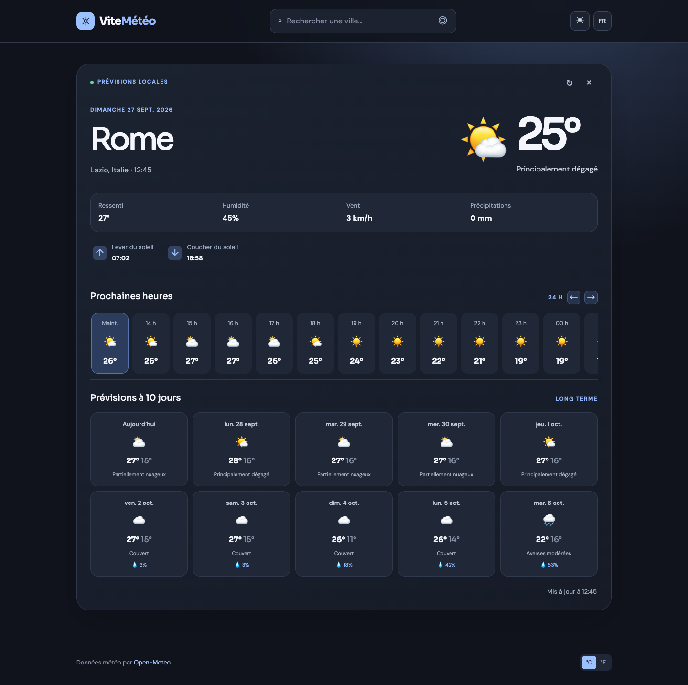
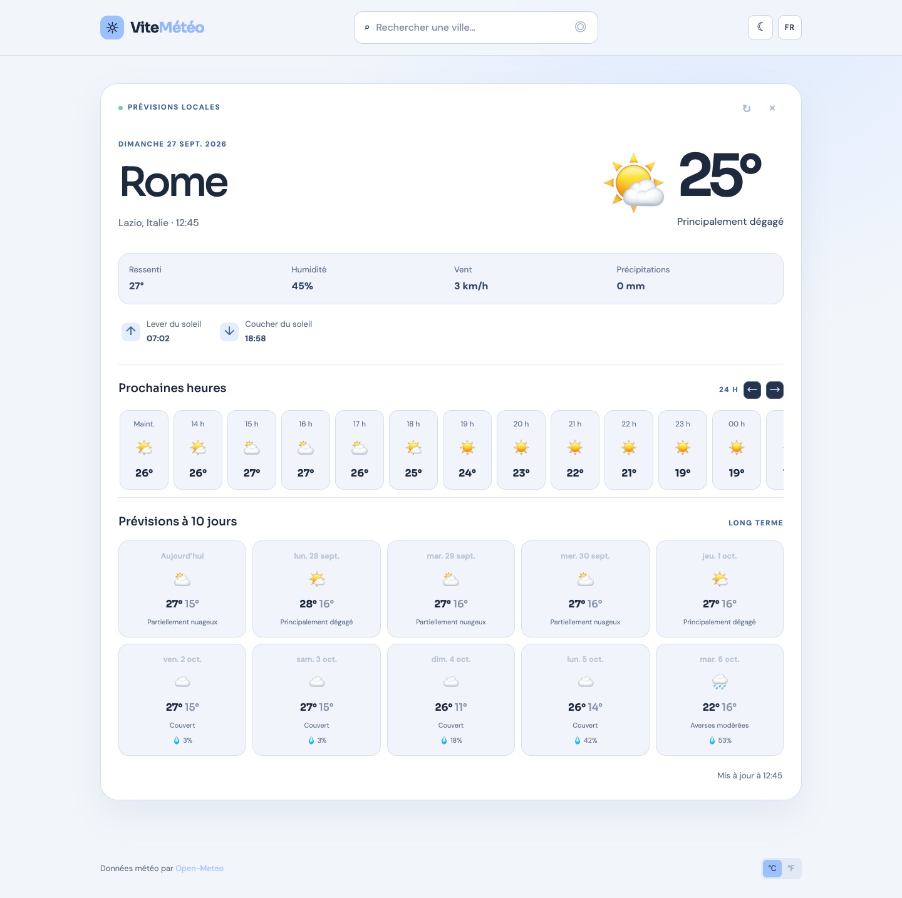

# ViteMétéo

Une application météo Vue 3 pensée pour consulter plusieurs villes rapidement. Le projet utilise Vite, Vue 3 et [Open-Meteo](https://open-meteo.com/) : aucune clé API n’est nécessaire pour un usage personnel ou non commercial.

## Fonctionnalités

- Recherche de villes avec géocodage et résultats accessibles au clavier
- Météo actuelle, ressenti, humidité, vent et précipitations
- Prévisions horaires sur 24 heures et prévisions quotidiennes sur 10 jours
- Conditions météo représentées par des icônes vectorielles/emoji nettes, indépendantes du fournisseur
- Géolocalisation du navigateur
- Plusieurs villes, suppression, actualisation et restauration via `localStorage`
- Bascule Celsius / Fahrenheit
- Mode clair / sombre avec préférence persistante
- Interface disponible en français, anglais et chinois
- Vue multi-villes : la ville active reste détaillée, les autres deviennent des cartes compactes cliquables
- États de chargement, d’erreur, de recherche vide et de première visite
- Interface responsive, contraste renforcé et prise en charge de `prefers-reduced-motion`
- Installable comme application (PWA) : mise à jour automatique et accès hors ligne aux dernières prévisions consultées

## Aperçu

Rome affichée dans les deux thèmes disponibles :

| Mode sombre | Mode clair |
| --- | --- |
|  |  |

## Développement

```bash
npm install
npm run dev
```

Créer un build de production :

```bash
npm run build
npm run preview
```

Le service worker n’est généré qu’au build : utilisez `npm run build && npm run preview` pour tester l’installation et le mode hors ligne.

Les icônes de l’application sont générées à partir de `public/logo.svg` :

```bash
npm run generate-pwa-assets
```

Aucune variable d’environnement n’est requise. `.env.example` documente l’emplacement réservé à une future intégration nécessitant une clé.

## Données et attribution

Les prévisions et le géocodage sont fournis par Open-Meteo. L’application affiche un lien d’attribution dans le pied de page. Open-Meteo est une excellente option gratuite et sans clé pour un projet personnel ; vérifiez ses conditions d’utilisation et ses exigences d’attribution avant un déploiement commercial.

## Structure

```text
src/
├── components/       # Recherche, météo actuelle et blocs de prévisions
├── services/weather.js # Appels Open-Meteo + normalisation des données
└── utils/             # Formatage localisé et messages FR/EN/ZH
```
